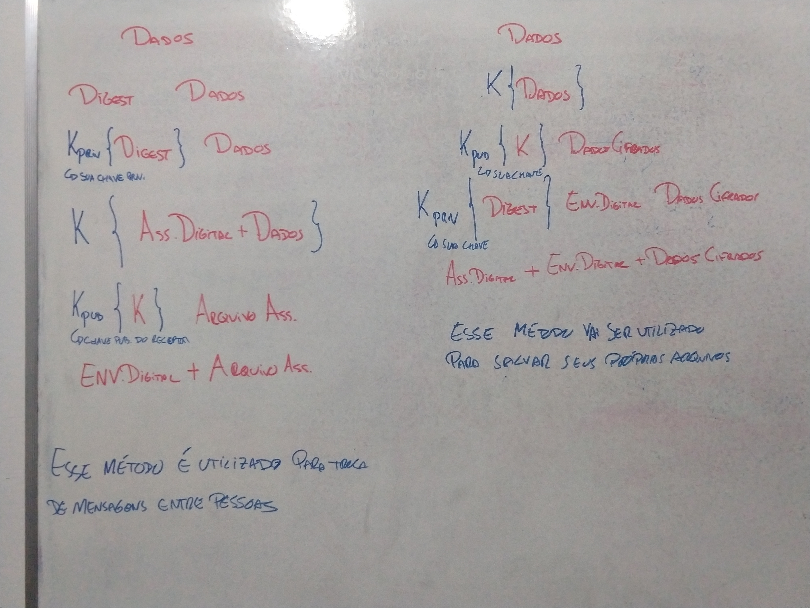

# Projeto Final
Nosso trabalho é basicamente divído em 3 partes:
* Interagir com interface para o usuário (**interface**)
* Garantir integridade, autenticidade e sigilo dos arquivos (**engine**)
* Interagir com o serviço de armazenamento (**plugin**)

  

Durante esse **README**, eu vou narrar as etapas considerando a situação:  
* Usuário quer sempre os arquivos com ele sem estarem criptografados
* Núvem vai sempre receber os arquivos criptografados

Dentro da engine irei tentar considerar outras opções se fizerem sentido, como:  
'usuário quer receber os arquivos criptografados'  
'usuário quer deixar os arquivos não criptografados na núvem'

# Engine
Toda parte do software responsável por garantir integridade, autenticidade e sigilo dos arquivos, além de interegir com a interface e os plugins.  

Considere que você está recebendo os arquivos do usuário...

## Integridade
Primeira coisa a ser feita é garantir *integridade* desses arquivos de agora em diante, para isso calculamos o **digest** deles e salvamos eles.  
Se quisermos ver se os arquivos foram alterados, basta calcular novamente o digest para os arquivos e conferir se é igual aos digests salvos.  

Que problema podemos ter?  
Se alguém invadir o seu sistema, essa pessoa pode alterar os arquivos, calcular os digests desses arquivos e substituir os digests salvos por esses novos. Você vai achar que os arquivos não foram alterados, quando na verdade foram.  

## Autenticidade
Segunda coisa a ser feita é garantir *autenticidade* desses arquivos de agora em diante, para isso vamos criptografar os **digests** com a **chave privada** daquele usuário. Digest criptografado com chave privada é mais conhecido como **assinatura digital**.  
Agora em vez de ter o digest salvo, teremos a assinatura digital salva. Dessa maneira mesmo se alguém invadir o sistema, alterar os arquivos e criar digests novos, aquela pessoa não vai ter a chave privada para criptografar o digest.  

## Sigilo
Terceira coisa a ser feita é garantir *sigilo* desses arquivos de agora em diante, para isso precisamos criptografar os arquivos. Essa criptografia utiliza um algoritmo simétrico pois é bem menos custoso.  
Para um arquivo do usuário teremos: **Arquivo cifrado** + **Assinatura digital**  
O arquivo foi cifrado com uma chave secreta (chave de algoritmo simétrico) criada na hora, no futuro precisamos dessa chave simétrica para decriptar o arquivo cifrado e enviar para o usuário.  

Como que você protege essa chave secreta?
Criptografando com a **chave pública** do usuário, dessa maneira apenas quem tem a chave privada consegue ler (apenas você).  

## Resumo
  
A idéia dessa imagem é mostrar a diferença entre troca de mensagens seguras entre duas pessoas e o que iremos fazer.  

# Enviando os arquivos para o usuário
Antes de enviar os arquivos para o usuário, você precisa tirar toda a criptografia que foi botada neles.  

## Recuperação
Para pegar o digest, precisa da chave publica, o que qualquer um pode ter acesso.  
Para pegar o arquivo, precisa da chave secreta, para pegar a chave secreta precisamos da chave privada.  
Concluimos que a única coisa necessária para recuperar tudo é a chave privada.  

Obs: Fica a gosto do usuário se ele quer guardar a chave privada só com ele ou em nosso sistema.  

Como vamos criar a chave privada?  
Para criar a chave privada, usaremos alguma informação do usuário como semente.  

Por exemplo, nos pedimos para o usuário por uma "frase secreta".  
Essa frase secreta, além de autenticar o usuário, vai ser usada como semente para um algoritmo pseudorandom.  
Esse algoritmo vai gerar um valor pseudoaleatório que utilizaremos para produzir a chave privada que decripta a chave secreta.  

# Organização arquivos
Os arquivos criptografados também teram nomes alterados, nomes código para não poderem ser identificados apenas olhando eles.  
`fotoThiago` => `poiewqytrh`  

**Como iremos encontrar o arquivo que queremos dessa maneira?**  
Teremos um **arquivo de indice** dentro de cada pasta que mapeia esses nomes códigos para o nome real.  

```
asdzxcqwer agenda.xls
bnmhjkyuik diario.txt
dfgertcvbg ferias.jpg
```

O arquivo de indice também recebe o tratamento de criptografia, ou seja, também é um container (arquivo cifrado + assinatura digital + envelope digital)  


#### Visão pelo Google Drive  
* Google Drive
  * \
    * [Folder A]
      * {File AA}
      * {File AB}
      * {File AC}
      * ...
    * [Folder B]
    * [Folder C]
    * ...
    * {File A}
    * {File B}
    * {File C}
    * ...
    * [SecureFolderRoot]
      * {SecureFolderRootIndex}
      * [ABCD000000]
        * {thnrgbefvg}
        * {asdzxcqwer}
        * {bnmhjkyuik}
        * {dfgertcvbg}
        * ...
      * [HHYYXX0000]
      * [TYUASDERTM]
      * ...

#### Visão pelo Aplicativo  
* Google Drive
  * \
    * [Folder A]
      * {File AA}
      * {File AB}
      * {File AC}
      * ...
    * [Folder B]
    * [Folder C]
    * ...
    * {File A}
    * {File B}
    * {File C}
    * ...
    * [SecureFolderRoot]
      * {SecureFolderRootIndex}
      * [SecureFolder0000]
        * {SecureIndex}
        * {agenda.xls}
        * {diario.txt}
        * {ferias.jpg}
        * ...
      * [SecureFolder0001]
      * [SecureFolder0002]
      * ...


# Plugin
Chamamos a parte do software que é responsável por interagir com o serviço de armazenamento de **plugin (plug-in)**.

A engine garante integridade, autenticidade e sigilo mas tem que funcionar independete de qual for o plug-in que vai utilizar.  
Para isso acontecer cada opção de plugin tem que ser acessado da mesma maneira, utlizando as mesmas chamadas.  

Após a engine cuidar da segurança ela chamará um plugin escolhido para armazenar os dados, como todos plugins tem a mesma chamadas, o software não precisa tratar cada plugin diferente.  

## Default
O plugin default vai ser armazenamento local, na própria maquina.  
Sendo ele o mais simples de todos, vamos primeiro tratar as interações básicas que plugins precisam ter.  

Operações básicas com **pastas**:  
* **Create folder**
* **List folder**
  * Você passa para o plugin a pasta que deseja saber o conteudo que tem dentro e o plugin retorna uma lista dizendo arquivos e pastas nela.  
* **Delete folder**

Operações básicas com **arquivos**:
* **Create file**
* **Read file**
  * Você passa para o plugin o arquivo que você deseja ler e ele retorna o conteudo do arquivo.  
* **Write file**
  * Você passa para o plugin o arquivo em qual você quer escrever e ele escreve nesse arquivo.
* **Delete file**

  

# Interface
A **interface** é a parte responsável por interagir com o usuário e fazer requesições a nossa engine. A idéia é podermos fazer a interface ser Android/Iphone/Computador... O que importa é conseguir passar os mesmos tipos de pedidos para a engine.  

A princípio a interface inicial é apenas o console, dessa maneira conseguimos testar a engine de forma correta.  

# Softwares com a mesma idéia
https://www.boxcryptor.com/en/  
https://cryptomator.org/  

# Algoritmos
AES - Cifra simétrica  
RSA - Cifra assimétrica  
SHA256withRSA ou SHA1withRSA - Assinatura (prioridade para primeira)  
