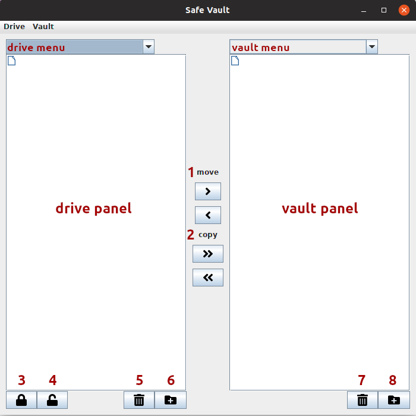
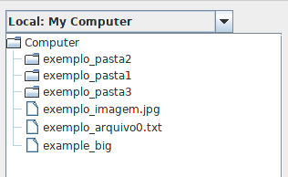
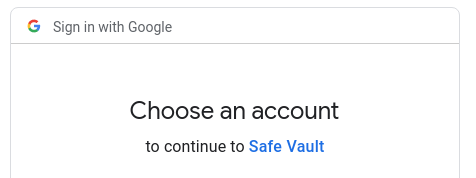
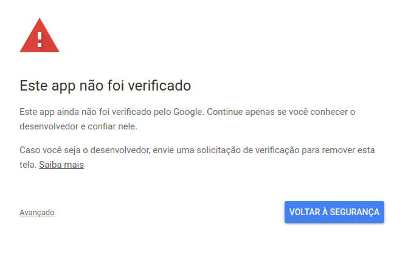
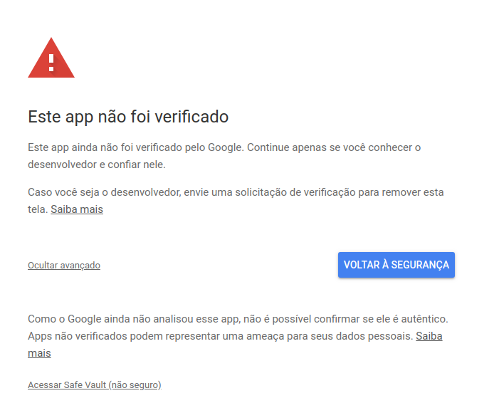
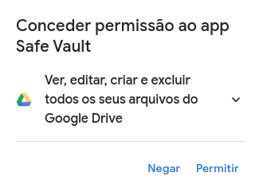
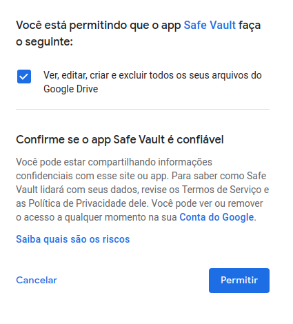
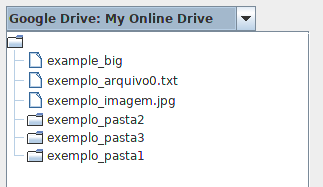

# PUC-INF1950
Projeto Final

# Ambiente de desenvolvimento
**Sistema operacional:** Ubuntu  
**Linguagem de programação:** Java 11  
**IDE:** Eclipse Photon  
**Serviços de armazenamentos:** Google Drive  

# Preparando o ambiente

* Instalar Java 11  
  * `sudo apt install -y openjdk-11-jdk`
* Instalar Eclipse
  * `sudo snap install eclipse --classic`

## Executando o projeto pela primeira vez
* É necessário obter as bibliotecas do Google Drive
  * Botão direito no projeto
  * Gradle
  * Refresh Gradle Project
* É necessário obter as credenciais para acessar a API do Google Drive
  * https://console.cloud.google.com/
  * Selecione/Crie seu projeto
  * Dentro de APIs & Services
  * Credentials
  * Baixe uma credencial em "OAuth 2.0 Client IDs"
    * Se for a primeira vez, vai ser necessário criar uma credencial
  * Altere o nome da credencial para "credentials.json"
  * Bote nas pastas *src* e *bin* do SafeVault, exemplo:
    * SafeVault002/bin/main/plugin/googledrive
    * SafeVault002/src/main/plugin/googledrive
* É necessário abrir o arquivo a `Main.java` do projeto
  * Abra o projeto
  * Abra a pasta `src/main/java`
  * Abra o pacote `_main`
  * Abra o arquivo `Main.java`  
  * Clique na seta ao lado do botão de executar
  * Run As
  * Java Application

# Interface/View

### Seleção de drive/vault
**drive menu:** Menu para seleção do drive  
**vault menu:** Menu para seleção do vault  

### Seleção de arquivo/pasta
**drive panel:** Arquivos no drive  
**vault panel:** Arquivos no vault  

### Interação entre panels
**1:** Par de botões para **mover** do drive para o vault e vice-versa  
**2:** Par de botões para **copiar** do drive para o vault e vice-versa  

### Drive panel
**3:** Cifra arquivo selecionado no drive panel  
**4:** Decifra arquivo selecionado no drive panel  
**5:** Exclui arquivo selecionado no drive panel  
**6:** Cria pasta no drive panel  

### Vault panel
**7:** Exclui arquivo selecionado no vault panel  
**8:** Cria pasta no vault panel  

# Plugin
Atualmente existem apenas 2 plugins:  
**Local:** Responsável por se comunicar com a máquina local  
**Google Drive:** Responsável por se comunicar com o Google Drive  

## Local
* Conectar com a máquina local:  
  * Drive
  * Add Drive
  * Local
  * Escolha um nome qualquer
    * Por exemplo: **My Computer**
  * Escolha a pasta a ser utilizada
    * Por exemplo: **Computer**

  

## Google Drive
* Conectar com a máquina local:  
  * Drive
  * Add Drive
  * Google Drive
  * Escolha um nome qualquer
    * Por exemplo: **My Online Drive**
  * Uma janela no seu navegador deve abrir, dentro dela:
    * Selecione a conta do Google Drive que você vai querer utilizar
    * Avançado
    * Acessar Safe Vault (não seguro)
    * Permitir
    * Permitir
    * Espere o aviso dizendo que pode fechar a janela
    * Feche a janela

  
  
  
  
  
  
  